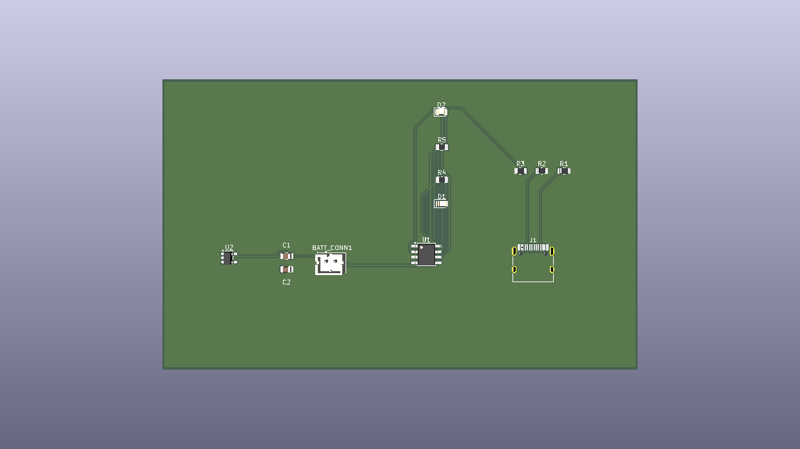

# ⚡ USB-C Power Module

A compact, open-source power delivery board that regulates USB-C input into clean, stable voltage rails while supporting Li-ion/LiPo battery charging and status indication. Designed in KiCad and fully DRC-clean, it's built to serve as a reliable power stage for embedded and portable electronics projects.

## Key Features

- 🔌 **USB-C Power Delivery** — Accepts standard USB-C input for power, eliminating the need for legacy micro-USB or barrel-jack connectors.
- 🔋 **Battery Charging & Connectivity** — Integrated charge management for single-cell Li-ion/LiPo batteries via the TP4056 charger IC, with a dedicated battery connector.
- 📟 **Regulated Voltage Rails** — Clean, stable 3.3V output using the AP2112K low-dropout (LDO) regulator, suitable for powering microcontrollers and sensitive analog/digital components.
- 💡 **Status Indicator LEDs** — Visual feedback for charging state (charging / fully charged) and power-good status at a glance.
- 🧰 **Filtered, Noise-Resistant Design** — Input/output capacitor filtering to smooth voltage ripple and suppress transient noise.
- ✅ **DRC-Clean Layout** — Passed KiCad's Design Rules Check with 0 errors and 0 warnings.

## Hardware Architecture

| Component | Purpose |
|---|---|
| **USB-C Receptacle** | Primary power input connector, supports standard USB-C cables |
| **TP4056** | Li-ion/LiPo battery charge management IC |
| **AP2112K** | Fixed 3.3V LDO voltage regulator for clean downstream power |
| **Input/Output Filter Capacitors** | Smooths voltage ripple and filters transient noise on both input and regulated output rails |
| **Indicator LEDs** | Visual status feedback for charging and power states |
| **Battery Connector (JST-PH or equivalent)** | Interface for connecting a single-cell Li-ion/LiPo battery |

## 📷 Visuals

> _Add a 3D board render or top-down screenshot here (KiCad → View → 3D Viewer → Export as PNG)._

```markdown

```

## Getting Started

1. Clone this repository
2. Open `USB-C-Power-Module.kicad_pro` in KiCad (version 7.x or later recommended)
3. Review the schematic and PCB layout under the **Schematic Editor** and **PCB Editor**
4. Generate manufacturing files (Gerbers/BOM) via **File → Fabrication Outputs** if you plan to order the board

## Open Source & Contributions

This project is open source and contributions are welcome — whether it's design improvements, additional footprints, documentation fixes, or suggestions for alternative components.

- 🐛 Found an issue? Open a [GitHub Issue](../../issues)
- 🔧 Want to contribute? Fork the repo, make your changes, and submit a pull request
- 💬 Questions or ideas? Start a discussion or reach out directly

Please ensure any submitted changes pass KiCad's DRC with 0 errors before opening a PR.

## License

This project is licensed under the [CERN Open Hardware License](https://cern-ohl.web.cern.ch/) (or your preferred open hardware license) — see the LICENSE file for details.
